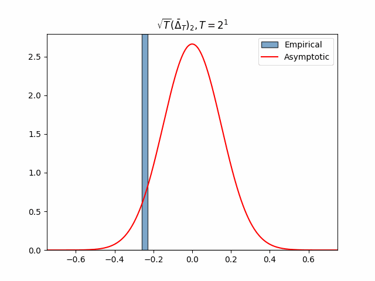
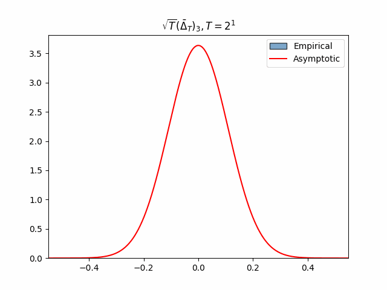

## Statistical Inference for Policy Evaluation with Temporal Difference Learning

<p float="left">
  
  
  
</p>

Use this repository to reproduce and explore the numerical simulations in the paper [Statistical Inference for Policy Evaluation with Temporal Difference Learning](https://arxiv.org/pdf/2410.16106), by Wu, et al., 2025.

### Packages to install

Install the following packages before running the scripts:

```
numpy, scipy, matplotlib, random, tqdm, yaml, click
```

### Run the simulations

In the root directory, run

```
python3 TD_iid.py --results/01
```

This would create an `MRP.npz` file and an `iid_results.npz` file under `results/01`. The first one stores the information of the Markov Reward Process, and the second one records the experimental results. Notice that the settings of the MRP and the TD learning algorithm are specified by the `config.yaml` file under the same directory. 

Rerun the command for all the directories under `results/` to generate all the data needed to reproduce the plots in the paper. You can also create new directories and make your own `config.yaml` files to explore different settings.

### Reproduce the plots

Use the `reproduce_plots.ipynb` notebook to reproduce the plots in the paper.
